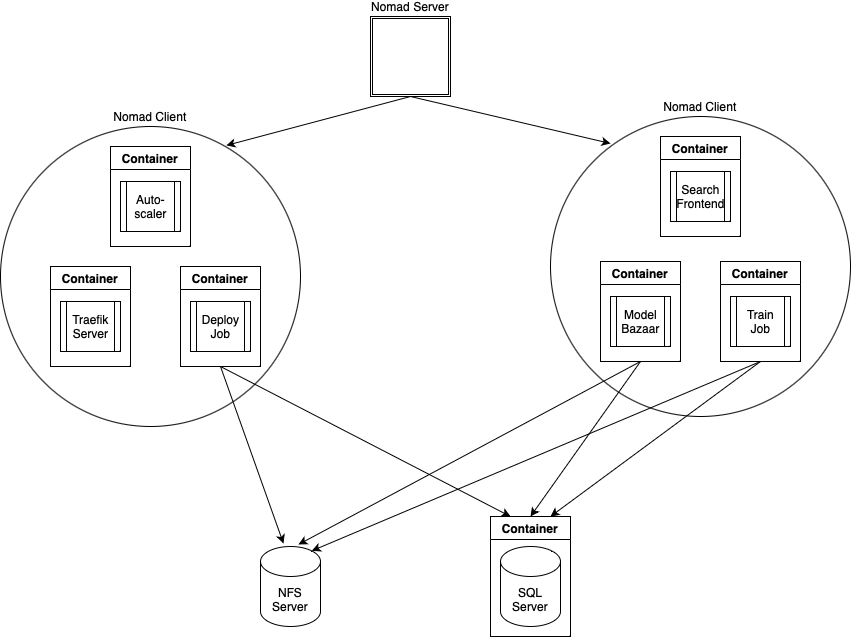

## What is NeuralDB Enterprise?
NeuralDB Enterprise is a ThirdAI product that allows users to manage the creation, training, and deployment of NeuralDB instances on their own cluster. We will be using "NeuralDB" and "model" interchangably in this document. To learn more about NeuralDB, check out https://github.com/ThirdAILabs/Demos.

One of the main components of NeuralDB Enterprise is the Model Bazaar. A user can create an account in Model Bazaar and train models under their account. Users can then set the visibility of their models to private, protected, or public, depending on what scope the user wishes to share their model under. In the Model Bazaar, users can also deploy their trained models, which will allow them to search over the corpus of documents that they trained their model on.

Users can interact with Model Bazaar through a user interface (which is launched when NeuralDB Enterprise is launched) or through a Python client. The documentation for the Python client is located in the `documentation` directory, along with an example Jupyter Notebook for more guidance.

NeuralDB Enterprise comes with autoscaling at train time and inference time for NeuralDBs. At training time of a NeuralDB model, users can specify the number of shards they would like to split their data in. This allows for the training process to be executed in parallel across different machines, which is particularly useful for large datasets where a single machine would be too slow and require excess amounts of RAM. At inference time, users can specify the maximum amount of autoscaling NeuralDB instances they require. NeuralDB Enterprise will automatically scale up or down the number of NeuralDB instances in the cluster based on the number of requests being made to the model, ensuring high query-per-second at peak traffic times and low resource utilization in down times.

## System Architecture

NeuralDB Enterprise is built on top of Hashicorp Nomad (https://www.nomadproject.io) to manage the orchestration of NeuralDB jobs on any cluster. Below is a high level overview of the architecture of NeuralDB Enterprise.

Nomad acts as a middleware, where the Nomad Server allocates jobs to Nomad Clients that have free resources. You can think of Nomad as a black box, where we can submit a script to run (in our case, these are Docker containers) and Nomad will allocate the job to a client that has enough resources to run that script. 

At NeuralDB Enterprise startup, we submit 4 jobs to Nomad:
1. Traefik Server
2. Model Bazaar
3. Nomad Autoscaler

These are all launched as Docker containers through Nomad, as seen in the diagram above.

The first component is the Traefik server, which redirects all requests from the public IP to the correct service in the Nomad cluster. The Traefik server must be running on the Nomad Client that has a public IP. This IP will be the access point for all users to interact with Model Bazaar, in order to train and deploy models. For example, let's say your public IP was 12.34.56.78. If someone navigates to http://12.34.56.78/ or http://12.34.56.78/train/{train_params} or http://12.34.56.78/deploy/{model_id}, the Traefik server will route that address to the Model Bazaar job. If someone navigates to http://12.34.56.78/search/{model_id}, Traefik redirects the request to the Search Frontend job. Note that the Traefik job is the only job that has a requirement for which node to be run on; the rest of the jobs can run on any node.

Next, the main component of NeuralDB Enterprise is Model Bazaar. Model Bazaar is a web application that also contains a UI, and it is responsible for user management and NeuralDB management. If a user wants to train a model, they will hit an endpoint such as http://12.34.56.78/train/{train_params}. This is routed through the Traefik server to the Model Bazaar job. The Model Bazaar job will then submit a train job to Nomad, which will spin up a Train job Docker container with the provided train parameters. Similarly, if a user wants to deploy on of their models, they would hit an endpoint like http://12.34.56.78/deploy/{model_id}, where the request is routed to Model Bazaar once again, but this time Model Bazaar will submit a Deployment job to Nomad. Note that a user will not be actually executing a raw HTTP request, but they will be doing so indirectly through the Model Bazaar UI or the Python Client. 

Once a user deploys a model, they can interact with the model through the Search Frontend. Once again, Traefik will redirect an address such as http://12.34.56.78/search/{model_id} to the Search Frontend job, where the user will be able to ask questions to their trained NeuralDB model.

Lastly, the Autoscaler job monitors the traffic load of each deployment job, and if the traffic for a deployment increases above a certain threshold, the Autoscaler will spin up another deployment job to help balance the load. And once the traffic goes back down, the Autoscaler job will deallocate deployment jobs.

There are also two services launched outside the Nomad scope:
1. NFS Server
2. SQL Server

Because these services should be persistent outside of the lifecycle of the Nomad Cluster, they are not submitted through Nomad. 
The NFS Server is an optional service, depending on if your cluster already has a shared directory across all nodes. This shared directory contains all the NeuralDB model checkpoints, all the data files to that NeuralDBs were trained on, and the NeuralDB Enterprise license. 
The SQL Server contains information about the state of Model Bazaar, such as the users in Model Bazaar, their models, the deployments, etc. The actual data directory for the SQL Database resides on the actual host node of the SQL Server and is mounted onto the SQL Server Docker container, so if the Docker container running the SQL server goes down, the data will still be present at the mounted directory on the host node.

The Model Bazaar job, the Train Job, and the Deployment job all have access to the NFS Server and the SQL Server. This allows for the sharing of data between nodes. For example, the NFS Server allows for different Nomad Clients on different nodes to access the same model checkpoints, in the case that one client trains and saves a model, and a different client needs to deploy the model. The SQL server also allows all Nomad Clients to share the same centralized state of Model Bazaar.

As shown above, all of the application code is located in Docker containers. These Docker containers are hosted on ThirdAI's container registry, so any time a new job is launched on a client, the client will download the corresponding Docker container from ThirdAI's container registry if it hasn't done so previously. 

All of the NeuralDB Enterprise application level jobs are launched from the Model Bazaar job, so to update your version of NeuralDB Enterprise, all you need to do is restart the Model Bazaar job. Since it points to the latest docker tag of Model Bazaar, if there is a new update to Model Bazaar, it will be pulled automatically when restarting the job. Then any subsequent train or deployment job will also use the latest version, which is tied to the Model Bazaar job version.

## Troubleshooting
The following is a list of commonly faced issues, and steps on how to resolve them.
- When a model is submitted for training or deployment, the status hangs and never completes
  - One possibility is that the cluster does not have enough resources to allocate any more jobs, leaving the train or deployment job in a pending state. To check for this, you can port forward port 4646 of any of your Nomad Clients to your localhost and visit localhost:4646 in your browser. You may also directly navigate to your http://{your_public_ip}:4646 if port 4646 is not blocked by a firewall on your node. This will bring up the Nomad UI, and from there, you will be able to see the resource allocation and usage of each of your nodes. Note that each train and deployment job reserves 6.8GB of memory, so even if the actual usage of a client with a deployment job may show low RAM utilization, it has still reserved 6.8GB of RAM that will not be able to be used by other jobs in NeuralDB Enterprise.
    - For more advanced debugging, one can navigate into the job definition and decrease RAM allocations for specific jobs to free up some space for other jobs to run.
- When a model is submitted for training, a license expired error pops up
  - This indicates that the NeuralDB License you are using is expired. You can retrieve a new one at https://neuraldb-enterprise-payment-frontend.vercel.app/ and upload it to $shared_dir/license on any of your nodes to renew the license. (shared_dir is defined in `config.json` under the `install` directory)